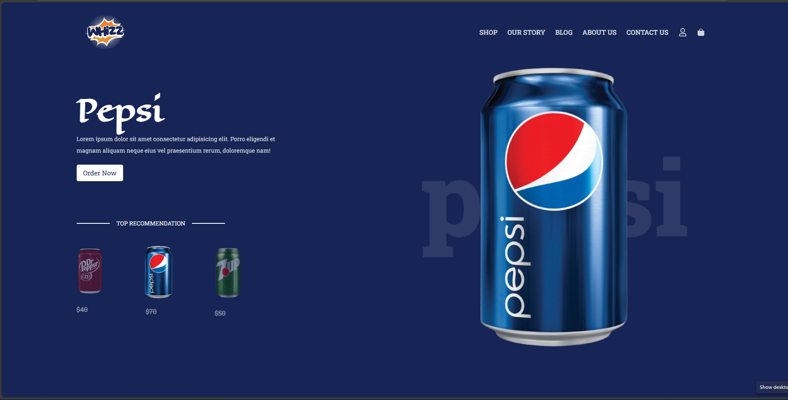

# Fizz Landing Page



## Project Overview

**Fizz Landing Page** is a modern, responsive landing page designed for a beverage brand called **Whizz**. This landing page includes multiple sections: product showcase, company story, FAQs, blog posts, contact form, and a professional footer. The goal is to provide an attractive, user-friendly, and interactive interface inspired by professional beverage websites like Coca-Cola.

During development, I explored modern UI/UX ideas, implemented smooth animations, and created a fully responsive layout for mobile, tablet, and desktop screens.

---

## Features

- Fully responsive design for all screen sizes
- Product showcase section with hover animations
- About / Company story section with images and descriptive text
- Blog section with cards for multiple posts
- FAQ section with smooth expand/collapse animation
- Contact form for user inquiries
- Professional footer with social links and company information
- Smooth animations using **Framer Motion**
- Icons using **React Icons**
- Styled with **TailwindCSS**

---

## Tech Stack

- **Frontend:** React 19  
- **Build Tool:** Vite  
- **Styling:** TailwindCSS 4  
- **Animations:** Framer Motion  
- **Icons:** React Icons  
- **Linting:** ESLint  

---

## Installation

1. **Clone the repository**
   ```bash
   git clone https://github.com/sameul-islam/fizz-landing-page
   cd fizz-landing-page
   npm install
   npm run dev

 